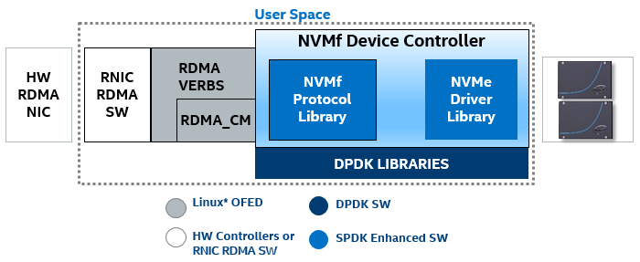

##SPDK NVMe over Fabrics Controller Released – 6/7/19

[Much][1] [has][2] [already][3] [been][4] [said][5] [about][6] [NVMe][7] [over][8] [Fabrics][9]. It was first publically demonstrated in 2014 and the 1.0 specification is finally complete. In essence, NVMe over Fabrics (NVMf) is the NVM Express* (NVMe) block protocol tunneled through an RDMA fabric, and it has _enormous_ potential to enable the next generation of datacenter storage development.
To support broad adoption of NVMf, the Storage Performance Development Kit ([SPDK](http://spdk.io)) project has created a reference user-space NVMf device controller implementation (the “target” in iSCSI terms) for Linux, released for community involvement via GitHub under BSD license. In parallel, community-based Linux* kernel efforts have created [both a host/initiator and a device controller/target](http://git.infradead.org/nvme-fabrics.git) under GPL license. All three of these implementations now released with the [final 1.0 specification][http://www.nvmexpress.org/wp-content/uploads/NVMe_over_Fabrics_1_0_Gold_20160605.pdf] as of June 8, 2016.

##SPDK NVMe over Fabrics Details

The first thing you need to know is that the SPDK NVMf device controller is a __reference__ NVMf protocol implementation designed for maximum efficiency in dedicated storage contexts. Like all other SPDK components, the NVMf device controller is designed to run the whole data path, from network to storage media, in user space, completely bypassing the kernel. And like all other SPDK components, the NVMf device controller is designed to use a polling-based, run-to-completion I/O model instead of dealing with interrupts. These techniques substantially reduce the software latency incurred in the traditional I/O path, maximizing the benefit of new, low-latency storage media like 3D XPoint®. However these techniques may also make the SPDK implementation unsuitable for general computing use cases, since bypassing the kernel carries certain risks and implications for security and data integrity. Again, the SPDK components are primarily designed for dedicated storage use cases. 
One important design point for the SPDK NVMf device controller is that it must support multiple RDMA protocols. This was achieved by building on top of the OpenFabrics Enterprise Distribution (OFED) layer, ensuring interoperability with any RDMA NIC (provided the RDMA NIC vendor supplies drivers compatible with the libibverbs layer). This means InfiniBand, iWARP, and RoCE are all supported by the SPDK NVMf device controller, and it means that any RDMA transport can be used interchangeably with the same code base. 

There are some next steps that the SPDK team intends to take after the initial code drop. At release, the NVMf device controller presents the NVMe devices directly, which for many use cases will be ideal. However, the SPDK team would like to create a block device abstraction layer in between the NVMf protocol and the NVMe device driver. This would allow for other back end devices, like spinning disks or block-addressed memory (like RAM disks) to be accessed via the NVMf protocol. In addition, this abstraction layer would allow for data services – things like data replication or de-duplication layers, encryption, or metadata – to be added to the SPDK framework. 

In addition, the SPDK team is planning on releasing an initiator which uses the SPDK techniques to further reduce software latency from the initiator side. On the other side of the NVMf device controller is an NVMf host. Think about it this way: the NVMf device controller is running on the storage system, handling many incoming requests from NVMf hosts running on compute resources. Using the kernel initiator works very well indeed, but for very demanding applications it may not be ideal. Just as SPDK reduces latency by bypassing the kernel on the target side, it can provide another improvement in latency by bypassing the kernel on the initiator side as well.
Finally, we’d like to follow up with a blog post detailing the performance measurements we’ve made during the development of the NVMf controller. While we can't disclose details yet, the initial findings are extremely promising. 

The SPDK community is growing and we are excited to release the NVMf controller code today. Of course, community pull requests are welcome and we would love to hear from users. Please contact us via [http://spdk.io] or [https://github.com/spdk/spdk]. 

[1]: http://www.nvmexpress.org/wp-content/uploads/NVM_Express_oF-1_2_Press_Release.pdf
[2]: http://www.nvmexpress.org/about/nvm-express-overview/
[3]: https://www.openfabrics.org/images/eventpresos/workshops2015/DevWorkshop/Monday/monday_10.pdf
[4]: http://www.flashmemorysummit.com/English/Collaterals/Proceedings/2015/20150811_FA12_Overview.pdf
[5]: http://www.chelsio.com/wp-content/uploads/resources/NVM_Express_Over_Fabrics.pdf
[6]: http://www.roceinitiative.org/uncategorized/rdma-interconnects-paving-the-way-for-nvme-over-fabrics-technology
[7]: http://nvmexpress.org/wp-content/uploads/2013/04/NVM_whitepaper.pdf
[8]: http://www.snia.org/sites/default/files/SDC15_presentations/networking/WaelNoureddine_Implementing_%20NVMe_revision.pdf
[9]: http://www.flashmemorysummit.com/English/Collaterals/Proceedings/2015/20150813_S303A_Davis.pdf

*  Other names and brands may be claimed as the property of others.
